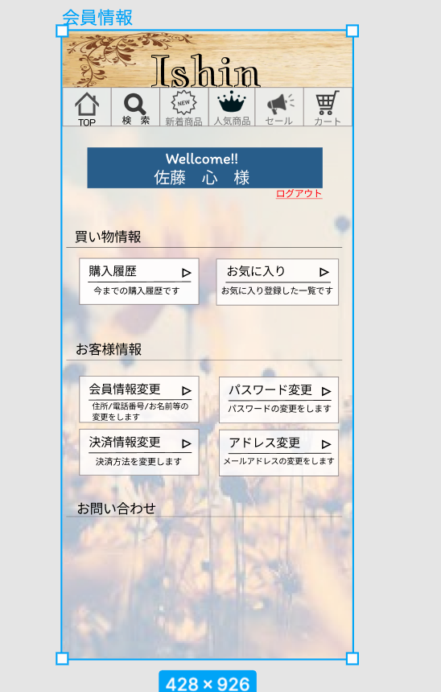

### 画面詳細図
## 会員情報
### プロトタイプは以下のリンクの先
[プロトタイプ](https://www.figma.com/file/wfKsQG6jSkNm7XGWE2f2lQ/Untitled?node-id=8%3A369)
*****

*****
補足：対応DBの列はDB設計後、〇を対応するテーブル・カラム名に差し替えること

###会員情報
| ID | 要素 | 内容 | アクション | イベント | 対応DB |
|----|-----|----------|----------|----------|-------|
|1   |会員様名前|テキスト表示|-|-|-|
|2   |ログアウト|画像・テキスト 表示|-|ログアウトする|-|
|3   |買い物情報|テキスト表示|-|-|-|
|4   |購入履歴|ボタン|クリック|購入履歴ページへ|-|
|5   |お気に入り|ボタン|クリック|お気に入りページへ|-|
|6   |お客様情報|テキスト表示|-|-|-|
|7   |会員情報変更|ボタン|クリック|購入履歴ページへ|-|
|8   |パスワード変更|ボタン|クリック|購入履歴ページへ|-|
|9   |決済情報変更|ボタン|クリック|購入履歴ページへ|-|
|10  |アドレス変更｜ボタン|クリック|購入履歴ページへ|-|

### 共通部分  

| ID | 要素 | 内容 | アクション | イベント | 対応DB |
|----|-----|------|----------|----------|-------|
|1   |バナー|サイト名表示|-|-|-|
|2   |TOP|ボタン|クリック|TOPページへ|-|
|3   |検索|ボタン|クリック|検索ページへ|-|
|4   |新着商品|ボタン|クリック|新着商品ページへ|-|
|5   |人気商品|ボタン|クリック|人気商品ページへ|-|
|6   |セール|ボタン|クリック|セールページへ|-|
|7   |カート|ボタン|クリック|カートページへ|-|
