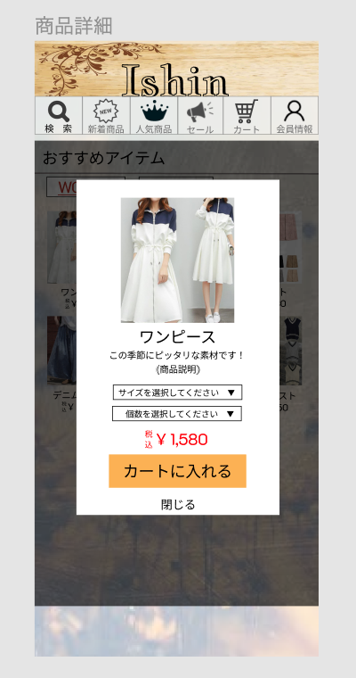

### 画面詳細図
## トップページ
### プロトタイプは以下のリンクの先
[プロトタイプ](https://www.figma.com/file/wfKsQG6jSkNm7XGWE2f2lQ/Untitled?node-id=8%3A369)
*****

*****
補足：対応DBの列はDB設計後、〇を対応するテーブル・カラム名に差し替えること

| ID | 要素 | 内容 | アクション | イベント | 対応DB |
|----|-----|----------|----------|----------|-------|
|1   |商品写真|画像表示|-|-|-|
|2   |商品名|テキスト表示|-|-|-|
|3   |商品説明|テキスト表示|-|-|-|
|4   |サイズ選択|選択|クリック|-|-|
|5   |個数選択|選択|クリック|-|-|
|6   |価格|テキスト表示|-|-|-|
|7   |カートに入れる|テキスト表示|ボタン|カートに入れる|-|
|8   |閉じる|テキスト表示|ボタン|前の画面に戻る|-|    

### 共通部分  

| ID | 要素 | 内容 | アクション | イベント | 対応DB |
|----|-----|------|----------|----------|-------|
|1   |バナー|サイト名表示|-|-|-|
|2   |検索|ボタン|クリック|-|-|
|3   |新着商品|ボタン|クリック|-|-|
|4   |人気商品|ボタン|クリック|-|-|
|5   |セール|ボタン|クリック|-|-|
|6   |カート|ボタン|クリック|-|-|
|7   |会員情報|ボタン|クリック|-|-|
