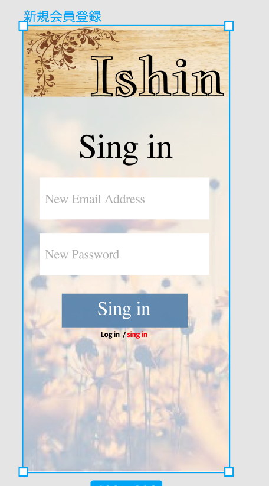

### 画面詳細図
## 新規登録
### プロトタイプは以下のリンクの先
[プロトタイプ](https://www.figma.com/file/d4xL9ktHVGUJp5gQHzUaT8/Untitled?node-id=0%3A1)
*****

*****
補足：対応DBの列はDB設計後、〇を対応するテーブル・カラム名に差し替えること

| ID | 要素 | 内容 | アクション | イベント | 対応DB |
|----|-----|------|----------|----------|-------|
|1   |sing in|テキスト表示|-|-|-|
|2   |sing in|画像表示|-|-|-|
|3   |メアド入力|入力Box|-|-|-|
|4   |パスワード入力|入力Box|-|-|-|
|5   |sing in|テキスト表示|クリック|新規会員登録|○| 
